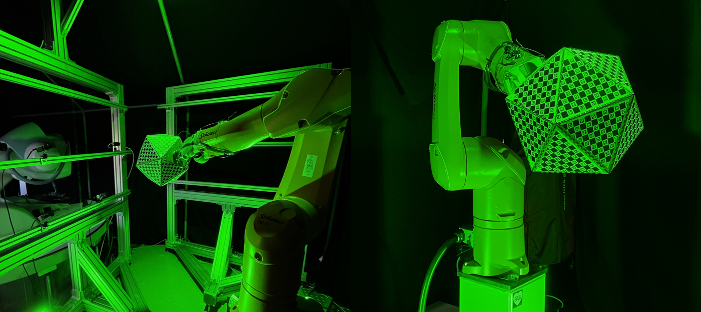

<p align="center">
  
 </p>

# All About Camera Calibration #
This repository is based on the implementation of the multi-camera calibration framework [Multical](https://github.com/oliver-batchelor/multical) with modification in the parameter initialization part to inhance the system's robustness, particularly in situations where camera views do not overlap. It also presents a complete guide for robot motion designed to facilitate automated image capture.

<p align="center">
  
 </p>

# Table of Contents  
* [Polygon design](#polygon)  
* [Board pattern design](#pattern)
* [Continuous Image acquisition](#image_aq)
* [Camera Calibration Framework](#cam_calib)


<a name="polygon"></a>

## Polygon design
- Useful link (https://hackaday.io/project/178164-polyhedral-dice-platonic-solids-2d-cad)
- [Icosahedron CAD File](https://gitlab.lrz.de/autotron-group/camera_calib_nova/-/tree/main/Polygon%20drawings?ref_type=heads)

<a name="pattern"></a>

# Board pattern design
- Useful link (https://docs.opencv.org/4.x/da/d0d/tutorial_camera_calibration_pattern.html)
- [Package](https://gitlab.lrz.de/autotron-group/camera_calib_nova/-/tree/main/tx60l_moveit_config/image_acquisition_automation/src/printing%20board?ref_type=heads)
-   Run [`write_board2.py`](https://gitlab.lrz.de/autotron-group/camera_calib_nova/-/blob/main/tx60l_moveit_config/image_acquisition_automation/src/printing%20board/write_board2.py?ref_type=heads)
- arguments 
`
--rows
9
--columns
12
-T
charuco_board
--square_size
13
--marker_size
8
-f
DICT_6X6_1000.json`
- In order to change board offet: Inside write_board2.py change `marker_id = 100`
- Create [boards.yaml](https://gitlab.lrz.de/autotron-group/camera_calib_nova/-/blob/main/Sample_files/boards.yaml) file accordingly

<a name="image_aq"></a>
# Continuous Image acquisition
## Robot motion
- [box_attacher_3.py](https://gitlab.lrz.de/autotron-group/camera_calib_nova/-/blob/main/tx60l_moveit_config/image_acquisition_automation/src/box_attacher_3.py) is adopted from box_attacher_2.py. The following functions are added that are helpful for image acquisition: 

    - move_ef_position(self, xPose, yPose, zPose)
    - plan_from_pose_json(self, pose_json_path)
    - plan_box_param(self, library = 'arv', path = "")
    - write_json(self, json_dict, pose, file_name)
- [main.py](https://gitlab.lrz.de/autotron-group/camera_calib_nova/-/blob/main/tx60l_moveit_config/image_acquisition_automation/main.py) contains script for using box_attacher_3.py
- sample [gripper_poses.json](https://gitlab.lrz.de/autotron-group/camera_calib_nova/-/blob/main/Sample_files/gripper_pose.json) that could be used in plan_from_pose_json() function
## Image acquisition libraries
### Aravis
<details><summary>Expand

</summary>

#### Camera Aravis API
- For installation follow this link: https://aravisproject.github.io/aravis/building.html
- Steps: 
    - At first, download source code from https://github.com/AravisProject/aravis/releases
    - Unzip and from terminal navigate to the folder
    - Download dependencies for Ubuntu 20.04
    ```
    sudo apt install libxml2-dev libglib2.0-dev cmake libusb-1.0-0-dev gobject-introspection \
                 libgtk-3-dev gtk-doc-tools  xsltproc libgstreamer1.0-dev \
                 libgstreamer-plugins-base1.0-dev libgstreamer-plugins-good1.0-dev \
                 libgirepository1.0-dev gettext
    
    pip3 install --user meson==0.56.0
    ```
    - Install
```
    meson setup build
    cd build
    ninja
    ninja install
    sudo ldconfig
```

#### Alternative way to install API
- Follow this method (https://github.com/roboticslab-uc3m/installation-guides/blob/master/install-aravis.md)
- Steps: 
    - Download a newer version from (https://download.gnome.org/sources/aravis/0.4/)
    - Uncompress the downloaded Aravis package and open a terminal in that folder.
    - Run `./configure`
    - Run `make`
    - Run `sudo make install`
    

#### Camera Aravis python
- pip install pyobs-aravis
- https://github.com/SintefManufacturing/python-aravis/blob/master/aravis.py
- https://github.com/SintefManufacturing/python-aravis
- https://github.com/SintefManufacturing/python-aravis/blob/5750250cedb9b96d7a0172c0da9c1811b6b817af/examples/save-image.py

#### Camera Aravis ROS Package
- Add this repo (https://github.com/FraunhoferIOSB/camera_aravis) in your catkin workspace 
- catkin_make

#### ROS camera aravis application
- Run `roscore`
- To check which camera models are connected, run from another terminal `arv-tool-0.4`.
    Output: 
    ```
    The Imaging Source Europe GmbH-11120229
    The Imaging Source Europe GmbH-42120643
    ```
- To run it in a given namespace 
`ROS_NAMESPACE=cam1 rosrun camera_aravis cam_aravis _guid:=GmbH-11120229`
- From another terminal, run `ROS_NAMESPACE=cam2 rosrun camera_aravis cam_aravis _guid:=GmbH-42120643`


#### Custom ROS Package (Implemented)

##### How to create ROS wrapper?
- Create ROS package (http://wiki.ros.org/ROS/Tutorials/CreatingPackage)
```
cd tx60_moveit/src
catkin_create_pkg camera_automation std_msgs rospy roscpp
catkin_make
```
- Create python node (http://wiki.ros.org/ROS/Tutorials/WritingPublisherSubscriber%28python%29)
- catkin_make
- chmod +x ros_wrapper.py
- Inside launch file 
```
<node pkg="xsens_driver" name="mtnode" type="mtnode.py" output="screen"> 
</node>
```
##### Issues
- `/usr/bin/env: ‘python3\r’: No such file or directory` : 
    - sudo apt install dos2unix
    - dos2unix python_file.py

##### Implemented Camera_automation ROS wrapper
- [package](https://gitlab.lrz.de/autotron-group/camera_calib_nova/-/tree/main/camera_automation)
- Command from console
```
roscore
rosrun camera_automation cam_node.py camera_serial_number exposure_time path_to_save_image
```
Example :
```
rosrun camera_automation cam_node.py 42120643 2000000 /home/raptor/tx60_moveit/src/tx60l_moveit_config/python_program/image/arv_im.png
```

#### Necessary Python Script (Implemented)
- [aravis_image_acquisition.py](https://gitlab.lrz.de/autotron-group/camera_calib_nova/-/blob/main/tx60l_moveit_config/image_acquisition_automation/src/aravis_image_acquisition.py?ref_type=heads) contains all functions for continuous image acquisition from all the cameras
- [aravis_show_image.py](https://gitlab.lrz.de/autotron-group/camera_calib_nova/-/blob/main/tx60l_moveit_config/image_acquisition_automation/src/aravis_show_image.py?ref_type=heads) contains all functions for the PyQT GUI

</details>


### TIS
<details><summary>Expand
</summary>

#### 20 MP TIS camera original software
- https://www.theimagingsource.de/support/software-f%C3%BCr-linux/
- It is installed with "sudo apt install .​/​tiscamera_0.n.n_amd64_ubuntu_1804.deb". "n" is to be replaced by the corresponding version number.
- After installation, start the "tcam-capture" program in the terminal to use a camera.
- Code example in https://github.com/TheImagingSource/tiscamera/tree/master/examples

</details>

### CVB
## Overview of good dataset

<a name="cam_calib"></a>

# Camera Calibration Framework
## Multical++
For this work, I edited some parts of the original implemetation of [Multical](https://github.com/oliver-batchelor/multical)
- Edited [package](https://gitlab.lrz.de/autotron-group/camera_calib_nova/-/tree/main/tx60l_moveit_config/image_acquisition_automation/src/multical)
- Following are some important scripts
    - [Detection](https://gitlab.lrz.de/autotron-group/camera_calib_nova/-/blob/main/tx60l_moveit_config/image_acquisition_automation/src/multical/board/common.py)
    - [Intrinsic](https://gitlab.lrz.de/autotron-group/camera_calib_nova/-/blob/main/tx60l_moveit_config/image_acquisition_automation/src/multical/camera.py)
    - [Bundle Adjustment](https://gitlab.lrz.de/autotron-group/camera_calib_nova/-/blob/main/tx60l_moveit_config/image_acquisition_automation/src/multical/optimization/calibration.py)

## HandEye Initialization
- [Tutorial](https://github.com/TabassumNova/Multi_Camera_Calibration/tree/main/Tutorials/HandEye_Calibrations_for%20_Cameras)
- [Package](https://github.com/TabassumNova/Multi_Camera_Calibration/blob/main/tx60l_moveit_config/image_acquisition_automation/src/multical_scripts/handEye_final.py)

# Environments
- python 3.10
- pip install opencv-contrib-python-headless==4.6.0.66
- pip install PyQt5
- pip install pandas
- pip install multical
- pip install plotly
- pip install scikit-learn
- pip install openpyxl
- pip install numpy==1.23.4
- pip install matplotlib==3.1.0
- pip install opencv-contrib-python==4.6.0.66

Or, one can directly use the virtual environment [venv](https://github.com/TabassumNova/Multi_Camera_Calibration/tree/main/venv)


# Bugs
- GUI "Show Final Camera Poses" visualization issue


# Visualization
## PyQt User Interface
This GUI automates the whole calibration process also shows results of the calibration
<p align="center">
  
  
 </p>
 
## Paraview guide
- https://www.youtube.com/watch?v=FTUBpqkC3Ss
- To add python shell in paraview application: view > Python shell
- Python program can be run from command prompt: 
    - To enable this, add the path of pvpython.exe 'Program Files/ParaView 5.11.0/bin' in environment variable
    - From cmd, run `pvpython.exe`
    - for loading imagefile `reader = OpenDataFile("D:/path_to_the_folder/group01_img1.png")`
    - Or write a python script and run from cmd `pvpython.exe D:/path_to_python_script/parav3.py`
      
# Issues
## OpenCV Issues
- For aruco, PyQT related issues
    - pip3 uninstall opencv-python
    - python3 -m pip install opencv-contrib-python
    - pip install opencv-contrib-python-headless==4.6.0.66
- `cv2.solvePnPGeneric` sometimes show irrelevent results
    - take 3/5 pictures of the same poses. Calculate pose. Take average of the poses
    - `cv2.solvePnP` and `cv2.solvePnPGeneric` both are taking solvePnP_Iterative method as default

- openCV >= 4.6 (Python>= 3.6): 
    - solvePnPGeneric/ solvePnP working
    - PyQt5 not working
- openCV = 4.2:
    - solvePnPGeneric not working
    - solvePnP working
    - PyQt5 working


## Hand-Eye Calibration Issues
```
cv2.calibrateRobotWorldHandEye(cam_world_R, cam_world_t, base_gripper_R, base_gripper_t, method=cv2.CALIB_ROBOT_WORLD_HAND_EYE_SHAH)
cv2.error: OpenCV(4.6.0) /work/ci_py311/opencv-suite_1676837327081/work/modules/calib3d/src/calibration_handeye.cpp:524: error: (-7:Iterations do not converge) Rotation normalization issue: determinant(R) is null in function 'normalizeRotation'
```
**Solution:** Remove the outlier image

## scipy issues
- Error from stats.gaussian_kde(values)
    ```
    numpy.linalg.LinAlgError: 3-th leading minor of the array is not positive definite
    ```
    **Solution**: values should have more than 3 groups
## numpy issues
```
AttributeError: module 'numpy' has no attribute 'int'.
`np.int` was a deprecated alias for the builtin `int`. To avoid this error in existing code, use `int` by itself. Doing this will not modify any behavior and is safe. When replacing `np.int`, you may wish to use e.g. `np.int64` or `np.int32` to specify the precision. If you wish to review your current use, check the release note link for additional information.
The aliases was originally deprecated in NumPy 1.20; for more details and guidance see the original release note at:
```
**Solution**: numpy.int was deprecated in NumPy 1.20 and was removed in NumPy 1.24. Downgrade numpy. `pip install numpy==1.23.4`
## PyQt5 Issues
```
Backend QtAgg is interactive backend. Turning interactive mode on. qt.qpa.plugin: Could not load the Qt platform plugin "xcb" in "" even though it was found. This application failed to start because no Qt platform plugin could be initialized. Reinstalling the application may fix this problem.  Available platform plugins are: eglfs, minimal, vkkhrdisplay, xcb, vnc, wayland, minimalegl, wayland-egl, linuxfb, offscreen.
```
- Same issue for [Dockerfile](https://gitlab.lrz.de/autotron-group/camera_calib_nova/-/blob/main/tx60l_moveit_config/image_acquisition_automation/Dockerfile?ref_type=heads)

**Solution (might not work)**: 
- Problem might come from PyQt5 of Python>=3.6. or matplotlib. Downgrade matplotlib `pip install matplotlib==3.1.0`
- try (https://github.com/NVlabs/instant-ngp/discussions/300)
- Uninstall and install opencv couple of times. Sometimes it works.

[Dockerfile](https://gitlab.lrz.de/autotron-group/camera_calib_nova/-/blob/main/tx60l_moveit_config/image_acquisition_automation/Dockerfile?ref_type=heads) commands:
```
docker build -t cam-calib-docker .
Docker run cam-calib-docker
```

# Credits
- This work is conducted at the Institute for Factory Automation and Production Systems([FAPS](https://www.faps.fau.eu/)), FAU-Erlangen, Germany.
- The [Robot Motion](https://github.com/TabassumNova/Multi_Camera_Calibration#robot-motion) part is based on the work from [Oguz Kedilioglu](https://github.com/Oguked)
- This work is based on the work of [Multical](https://github.com/oliver-batchelor/multical)
- Much Inspiration is taken from [CALICO](https://github.com/amy-tabb/calico) and [MC-Calib](https://github.com/rameau-fr/MC-Calib)
- Some visualization inspiration is taken from [rc-visard](https://doc.rc-visard.com/v1.3/en/handeye_calibration.html)
